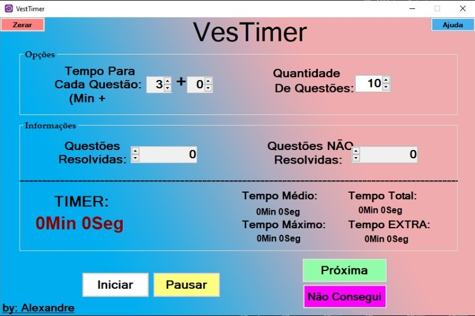

 

  <h3 align="center">VesTimer</h3>

  

	It is a desktop application that helps students to control the time of each exercise to train for entrance exams.
	 
	This was one of my first projects when I started to learn how to code.
     
	 
    <a href="https://github.com/xandao6/ves-timer"><strong>Explore the docs »</strong></a>
     
    <a href="https://github.com/xandao6/ves-timer/issue">Report Bug</a>
    ·
    <a href="https://github.com/xandao6/ves-timer/issues">Request Feature</a>
  

<!-- TABLE OF CONTENTS -->

  
Table of Contents

  <ol>
    <li>
      <a href="#about-the-project">About The Project</a>
      <ul>
        <li><a href="#features">Features</a></li>
        <li><a href="#built-with">Built With</a></li>
      </ul>
    </li>
    <li><a href="#roadmap">Roadmap</a></li>
    <li><a href="#contributing">Contributing</a></li>
    <li><a href="#license">License</a></li>
    <li><a href="#contact">Contact</a></li>
  </ol>

## About The Project

  

### Features

* Real time control of the robot arm
* Record and playback movements
* Save and load frames

### Built With

* [WPF](https://docs.microsoft.com/en-us/dotnet/desktop/wpf/?view=netdesktop-5.0) - Desktop application framework
* [C#](https://docs.microsoft.com/en-us/dotnet/csharp/) - C# Programming Language

## Roadmap

See the [open issues](https://github.com/xandao6/ves-timer/issues) for a list of proposed features (and known issues).

## Contributing

Contributions are what make the open source community such an amazing place to be learn, inspire, and create. Any contributions you make are **greatly appreciated**.

1. Fork the Project
2. Create your Feature Branch (`git checkout -b feature/AmazingFeature`)
3. Commit your Changes (`git commit -m 'Add some AmazingFeature'`)
4. Push to the Branch (`git push origin feature/AmazingFeature`)
5. Open a Pull Request

## License

Distributed under the MIT License. See [LICENSE](./LICENSE.md) for more information.

Free software =)

## Contact

Alexandre Calil - [@xandao6](https://www.linkedin.com/in/xandao6/) - alexandrecalilmf@gmail.com

Project Link: [https://github.com/xandao6/ves-timer](https://github.com/xandao6/ves-timer)
